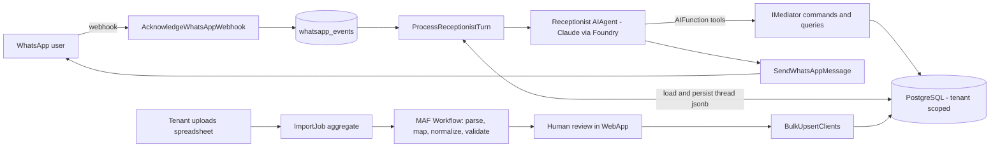

# Agentic System Evaluation — Microsoft Agent Framework on NerovaBookings

Status: Evaluation / implementation spec for MVP
Date: 2026-06-10
Decisions locked: 2 agents (Receptionist + Data Import), Claude via Microsoft Foundry, WhatsApp-only channel for MVP.

## 1. Verdict

The existing architecture is unusually well-positioned for an agentic layer. Three things normally built from scratch for an AI receptionist already exist here:

1. **A complete, permission-checked tool catalog.** Every booking capability is a MediatR command/query returning `Result<T>` (`CreatePublicBooking`, `CancelBooking`, `RequestReschedule`, slot queries in `Collective`, etc.). Agent tools become thin wrappers over `mediator.Send()` — validation, tenant scoping, and permissions pipelines are reused for free.
2. **A production WhatsApp channel.** Webhook ingestion with signature verification (`AcknowledgeWhatsAppWebhook`), an event inbox (`WhatsAppEvent`), outbound messaging (`SendWhatsAppMessage`), customer identity (`WhatsAppLoginChallenge` → `UpsertClientFromWhatsAppLogin`), and a per-customer session aggregate (`WhatsAppConversation`).
3. **Multi-tenant state, observability, and monetization rails.** EF Core/PostgreSQL with `ITenantScopedEntity` query filters, `TelemetryEvents` + OpenTelemetry, per-tenant `FeatureFlags`, and Billing/Subscriptions in the account SCS for usage metering.

Microsoft Agent Framework (MAF) reached **1.0 GA on April 2, 2026** for .NET (`Microsoft.Agents.AI`). Agents, tools, middleware, memory/thread serialization, and the graph workflow engine are stable. The durable runtime (`Microsoft.Agents.AI.DurableTask`) is still prerelease — we deliberately do not take it for MVP.

**Recommended shape:** independent single agents with tools — no inter-agent orchestration at MVP.

- **Receptionist agent** (MVP) — conversational, turn-based, lives in the WhatsApp message loop.
- **Data Import agent** (MVP) — a MAF workflow (graph of executors, one of which is an agent) that normalizes arbitrary spreadsheets into Clients, services, and booking history, with human approval before commit. This is the adoption wedge: a salon owner uploads their messy client book and is live in minutes.
- **Owner agent** (post-MVP, Phase 5) — outbound, scheduled, owner-facing: weekly digests, proactive insights, suggested actions. Required to fully deliver the four AI Front Desk pillars in the pitch deck (see §4.3).

## 2. What exists today and what role it plays

| Existing asset | Location | Role in agentic system |
| --- | --- | --- |
| Webhook ingestion + event inbox | `WhatsAppMessaging` (`AcknowledgeWhatsAppWebhook`, `WhatsAppEvent`) | Channel entry point, idempotency, audit trail |
| Conversation state machine (deterministic, WhatsApp Flows) | `WhatsAppBooking/Domain/WhatsAppConversation` | Session anchor; agent replaces the NL branches, Flows remain as structured tools and fallback |
| Customer identity | `WhatsAppLoginChallenge`, `UpsertClientFromWhatsAppLogin` | Gate: write tools require `IsIdentified == true` |
| Booking command surface | `Scheduling/Commands/*` (17 commands) | Receptionist tool catalog |
| Availability/slots | `Collective`, `Schedules`, `EventTypes`, `RoundRobin` | Read tools + grounding ("what can be booked, when") |
| Client records | `Clients` | Import agent target; receptionist personalization |
| Reminders/notifications | `Workflows` feature | Stays deterministic — post-booking automation is NOT agentic |
| Outbound messaging | `SendWhatsAppMessage`, `MetaGraphClient` | Agent reply delivery |
| Tenant isolation + permissions | `ITenantScopedEntity`, `Permissions/Pipeline` | Hard safety boundary under every tool |
| Telemetry, flags, billing | `TelemetryEvents`, `FeatureFlags`, account SCS Billing | Rollout control, observability, usage-based pricing |

The vendored `cal.com/` repo is treated as reference material only; agents target the .NET domain in `main`, never cal.com APIs.

## 3. MAF 1.0 capability mapping

**Use at MVP**

- `AIAgent` over `IChatClient` — Claude (Sonnet 4.5 default, Haiku for cheap paths later) via the Microsoft Foundry connector, managed identity in Azure, key locally.
- `AIFunction` tools — strongly typed delegates wrapping `IMediator` calls.
- Middleware pipeline — guardrails (tool allowlist by conversation state, token/turn budgets, PII-scrubbed logging, injection defenses).
- Thread serialization — MAF agent threads serialize to JSON; persisted as `jsonb` in PostgreSQL. **Postgres is our checkpoint store.**
- `WorkflowBuilder` (in-process) — Data Import pipeline graph.
- DevUI — local debugging during development.
- OTel GenAI semantic conventions — flow into the existing Aspire dashboard / Application Insights.

**Deliberately skip at MVP**

- `Microsoft.Agents.AI.DurableTask` + Durable Task Scheduler — prerelease, adds Azure Functions/DTS infrastructure we don't need. A receptionist turn is short-lived, stateless compute over persisted state: **the inbound WhatsApp message is the resume trigger.** Nothing runs for hours.
- Multi-agent orchestrations (handoff, group chat, Magentic) — one agent with 9 tools beats a fleet for reliability and debuggability. Revisit when tool count or domain breadth forces it.
- A2A, MCP tool exposure, Foundry hosted agents, declarative YAML agents, Agent Harness — no MVP value.

**Model provider note:** Claude models in Microsoft Foundry (Opus 4.6, Sonnet 4.5, Haiku 4.5 as of mid-2026) currently execute on Anthropic-operated infrastructure billed through Foundry; EU-native Azure hosting is targeted during 2026. Acceptable for MVP; flag for future enterprise/data-residency tenants.

## 4. Target architecture



New feature folders inside the `main` SCS (no new SCS; modular monolith is correct here):

```
main/Core/Features/Receptionist/{Domain,Commands,Queries,Agent,Shared}
main/Core/Features/DataImport/{Domain,Commands,Queries,Agent,Shared}
```

Agent registration helpers stay in `main` for MVP; lift to shared-kernel only when the account SCS needs agents.

### 4.1 Receptionist agent

**Turn lifecycle.** Inbound text message → `AcknowledgeWhatsAppWebhook` (exists, unchanged) → dispatch `ProcessReceptionistTurnCommand(conversationId, messageId)` → handler:

1. Load `WhatsAppConversation` + `ReceptionistSession` (new aggregate: `agent_thread` jsonb, token counters, escalation state; keyed to the conversation).
2. Build the agent: per-tenant persona instructions composed from `OrgProfile` + receptionist settings + EventType summary; tool set filtered by conversation state.
3. `agent.RunAsync(message, thread)` — model reasons, calls tools, produces reply.
4. Send reply via `SendWhatsAppMessageCommand`; persist serialized thread; collect telemetry event; commit.

**Tool catalog (MVP, ~9 tools).** Each tool is an `AIFunction` whose body sends an existing command/query through `IMediator`; `Result` failures map to tool-error strings the model can recover from conversationally.

| Tool | Wraps | Gated by identity |
| --- | --- | --- |
| `GetEventTypes` | EventTypes query | No |
| `GetAvailableSlots` | Collective slots query | No |
| `GetBusinessInfo` | OrgProfile query | No |
| `SendLoginFlow` | existing login Flow | No (the gate itself) |
| `CreateBooking` | `CreatePublicBooking` | Yes |
| `RescheduleBooking` | `RequestReschedule` | Yes |
| `CancelBooking` | `CancelBooking` | Yes |
| `GetMyBookings` | bookings query (own client only) | Yes |
| `EscalateToHuman` | new command → support/notification | No |

**Execution context — the critical design point.** The webhook is anonymous. Tools must run under a system execution context scoped to the conversation's `TenantId` and (when identified) `ClientId` — established by the turn handler, exactly as the deterministic engine does today. Tool parameters never include tenant or client identifiers; the model cannot choose them. This makes the worst-case prompt-injection blast radius "a customer manages their own bookings" — which is the product working as intended.

**Concurrency and UX.** Serialize turns per conversation (customers double-text); debounce rapid messages into one turn; send read receipts/typing via `MetaGraphClient`. Meta's 24-hour customer-service window is naturally satisfied since the agent only ever replies; templated outbound stays in the existing `Workflows` feature.

**Coexistence and rollout.** The deterministic Flow engine remains the fallback. A per-tenant feature flag selects `FlowsOnly` (today) vs `Agentic`. The agent can itself send a booking Flow (`SendLoginFlow`, and optionally `SendBookingFlow`) when structured input beats conversation — hybrid by design.

### 4.2 Data Import agent

Not a chat agent — a **MAF workflow with an agent executor inside**, because normalization is a deterministic pipeline with one genuinely fuzzy step (schema inference).

```
ParseFile → InferColumnMapping (agent, structured output)
         → NormalizeRows (deterministic; agent fallback per ambiguous row)
         → ValidateRows (existing FluentValidation rules)
         → AwaitApproval (human-in-the-loop: WebApp review screen)
         → CommitRows (new BulkUpsertClients command, batched, idempotent)
         → Report
```

- **`ImportJob` aggregate**: blob reference, status, inferred mapping (jsonb), per-row results (jsonb), counters. The aggregate IS the checkpoint — each workflow step is triggered by a command and persists state, so a crashed step re-runs from the aggregate without the durable runtime.
- **Human-in-the-loop** follows MAF's `RequestPort` concept but implemented on our rails: job pauses at `ReadyForReview`; tenant reviews mapping + diff in the WebApp; `ApproveImportJobCommand` resumes the workflow.
- **MVP scope**: CSV → Clients. XLSX requires a parsing library (see exceptions below). EventTypes/Schedules import is Phase-2 of this agent.
- **New commands needed**: `StartImportJob`, `ApproveImportJob`, `RejectImportJob`, `BulkUpsertClients` (Clients currently has no bulk create path — only `BulkDeleteClients`).

### 4.3 Coverage against the AI Front Desk promise (Nerova_v5 deck)

Slide 9 sells four pillars and a principle. The principle — "AI orchestrates the deterministic core, never replaces it" — is exactly this architecture (tools wrap commands; Flows/core survive AI outage). Pillar coverage:

| Deck promise | Covered by | Status |
| --- | --- | --- |
| **AI Reception Agent** — autonomous inbound, books/reschedules/cancels, escalates only on judgment | §4.1, Phases 1–2 | Covered, two additions below |
| **Business Intelligence** — no-show patterns, peak/revenue trends, at-risk client scoring | Not in original plan | Gap → Phase 5 |
| **Proactive Insights** — weekly WhatsApp summary to owner, suggested actions, loyalty/review nudges | Not in original plan | Gap → Phase 5 |
| **Ops Automation** — stale schedule cleanup, failed payment recovery, smart reminder timing | Not in original plan | Gap → Phase 6 (mostly deterministic) |
| **AI Data Migration** (slide 12) — "clients, services, and history" | §4.2 covered clients only | Gap → import scope widened |

**Additions to the Reception Agent (Phase 2):**

- **Deposit collection in-conversation.** The deck's no-show promise depends on payment at booking. The agent loop must drive it: `CreateBooking` → Paystack payment link / payment Flow step → confirm on `BookingPaymentStatus` webhook → only then confirm to the customer. The Payments feature has the rails; the agent needs a `RequestDeposit` tool and a resume-on-payment-webhook turn.
- **Escalation inbox.** "Escalates only when human judgment is needed" silently reintroduces admin unless escalations land in a one-tap surface: a WhatsApp template message to the owner with approve/decline buttons (and a WebApp queue). Without this, escalations become the new front-desk admin and the zero-admin promise breaks.

**The third agent: Owner Agent (Phase 5).** BI + Proactive Insights are one outbound, scheduled, owner-facing agent — not part of the receptionist:

- Deterministic analytics jobs compute the numbers (extend the existing `Insights` queries: no-show rates, peak hours, retention/at-risk scoring). The model narrates and suggests; it never computes. This keeps it cheap and non-hallucinatory.
- Weekly digest + "3 open slots Friday — send a promo?" delivered to the owner's WhatsApp. These are owner-initiated-window or **approved template messages** (outside the 24h customer-service window — template approval is a Meta lead-time item, start early).
- Suggested actions are buttons that trigger existing commands — the owner approves, the system executes. Same tools-over-mediator pattern, same execution-context rules.

**Ops Automation (Phase 6) is mostly not AI.** Failed-payment retry (Payments/Jobs), reminder workflows (Workflows feature), and schedule-drift cleanup are deterministic background jobs — some already half-exist. The only model-shaped piece is smart reminder timing (per-client send-time scoring), which can ship last. Selling this as "AI Front Desk" is fine; building it as jobs is correct.

**Import agent scope (revised).** Slide 12 promises clients, services, and history. Phase 3 becomes: Clients → EventTypes/services (price list inference) → booking history (imported as historical `Booking` records to power BI scoring from day one). Note the deck says "instantly" with deterministic mapping; the human-review gate stays (wrong merges destroy trust in week one) but should be one-tap confirm with auto-approve at high confidence.

## 5. Cross-cutting integration

**Dependency injection.** `AddReceptionistAgent()` / `AddDataImportAgent()` extensions register a typed `IChatClient` (Foundry endpoint + deployment from configuration; `DefaultAzureCredential` when `SharedInfrastructureConfiguration.IsRunningInAzure`, API key locally via user-secrets/Aspire). Agents are built per turn from tenant configuration — cheap, stateless, correct for multi-tenancy.

**NuGet exceptions (explicit, deliberate).** The repo rule is "never introduce new NuGet dependencies." This initiative requires a one-time, pinned exception in `Directory.Packages.props`:

| Package | Why | Status |
| --- | --- | --- |
| `Microsoft.Agents.AI` | Core agent abstraction | 1.x stable |
| `Microsoft.Agents.AI.Workflows` | Import pipeline graph | 1.x stable |
| Foundry/Anthropic connector package | Claude via Foundry `IChatClient` | 1.x stable |
| `ClosedXML` (optional) | XLSX parsing for import agent | Defer if CSV-only MVP |

Explicitly NOT taken: `Microsoft.Agents.AI.DurableTask`, Azure Functions hosting, Redis/Mem0 memory stores.

**Telemetry events** (existing pattern — past tense, snake_case, collected before return):

- `ReceptionistTurnCompleted(conversation_id, tool_call_count, input_tokens, output_tokens, latency_ms)`
- `ReceptionistEscalated(conversation_id, reason)`
- `BookingCreatedByAgent(booking_id, event_type_id)`
- `ImportJobCompleted(import_job_id, rows_total, rows_committed, rows_rejected)`

**Cost control and billing.** Token counters on `ReceptionistSession` enforce per-session and per-tenant monthly budgets via middleware (graceful "let me connect you with the team" on breach). Aggregated token telemetry feeds account-SCS Billing for usage-based pricing later.

**Testing strategy.**

- API tests use a **deterministic fake `IChatClient`** (scripted responses/tool calls) — agent plumbing, tool wiring, state persistence, and guardrails are testable without a model, fitting the existing test approach.
- Architecture tests: tools may depend on `IMediator` only — never `DbContext` or repositories directly.
- Golden-transcript evals against the real model run out-of-band (not in CI) starting Phase 2.

## 6. Risks and mitigations

| Risk | Assessment | Mitigation |
| --- | --- | --- |
| Durable runtime prerelease | Avoided entirely | Postgres-as-checkpoint design; revisit at GA for multi-day jobs |
| Prompt injection via public WhatsApp | Contained | Identity-gated tools, injected tenant/client context, no cross-client tools, allowlist middleware |
| Claude-on-Foundry runs on Anthropic infra | Acceptable for MVP | Disclose in DPA; EU-native Foundry hosting targeted 2026 |
| Token cost blowout | Real | Budget middleware, Haiku for cheap turns, debounced turns, capped thread length |
| Hallucinated bookings | Real | Bookings only via commands (validation enforced); confirmation summary before `CreateBooking`; Flow fallback |
| Latency on WhatsApp | Low | Seconds are acceptable on the channel; typing indicators |
| Rollout regression | Low | Per-tenant flag, Flows engine unchanged as fallback |

## 7. Phased plan to MVP

| Phase | Scope | Exit criteria |
| --- | --- | --- |
| 0 — Foundation | Packages pinned, `IChatClient` DI (Foundry/Claude), fake client, feature flags, telemetry events, `ReceptionistSession` aggregate + migration | Build green; a hardcoded agent answers in a test |
| 1 — Read-only receptionist | Persona from OrgProfile; tools: event types, slots, business info, login Flow, escalate | Pilot tenant answers real customer questions; zero write access |
| 2 — Booking receptionist | Identity gate; create/reschedule/cancel/my-bookings tools; **deposit collection in-conversation**; **escalation inbox (owner WhatsApp template + WebApp queue)**; confirmation pattern; budget middleware | First end-to-end agent-created, deposit-paid booking in production |
| 3 — Data Import agent | `ImportJob` + workflow + review UI + `BulkUpsertClients`; CSV first; then services/EventTypes and booking history | New tenant onboards clients, price list, and history via upload |
| 4 — Hardening | Evals, per-tenant model config, BackOffice agent observability, usage billing, XLSX | Agent metrics on dashboard; cost per conversation known |
| 5 — Owner Agent (BI + Proactive Insights) | Deterministic analytics jobs (no-show, peaks, at-risk scoring) extending `Insights`; weekly WhatsApp digest via approved templates; suggested-action buttons wired to commands | Pilot owner receives weekly digest and executes a suggested action from WhatsApp |
| 6 — Ops Automation | Failed-payment recovery, schedule-drift cleanup, loyalty/review nudges as deterministic jobs; smart reminder timing (model-scored) last | Measurable no-show reduction; zero manual payment chasing for pilot tenants |

Phases 1–2 are the receptionist MVP; Phase 3 is the adoption wedge; Phases 5–6 complete the four AI Front Desk pillars from the deck (and map to the premium AI tier in the business model). Each phase ships dark behind flags. Start Meta template-message approval during Phase 2 — it gates Phase 5 delivery.

## 8. Open questions

1. How much receptionist persona customization do tenants get at MVP (tone, languages, FAQ free-text) vs. derived-only from OrgProfile?
2. Pricing: the deck defines an AI Front Desk premium tier — which pillars gate the tier (reception only, or reception + owner agent)? Token metering inside the tier or flat?
3. Voice channel ambitions (affects nothing now; ACS/Twilio later would reuse the same agent + tools).
4. Escalation inbox: owner's personal WhatsApp via templates, the WebApp queue, or both at MVP?
5. Historical bookings import: how far back, and do imported no-shows count toward at-risk scoring immediately?

## References

- MAF 1.0 announcement: https://devblogs.microsoft.com/agent-framework/microsoft-agent-framework-version-1-0/
- MAF docs: https://learn.microsoft.com/en-us/agent-framework/overview/
- Durable workflows (and why we skip them for now): https://devblogs.microsoft.com/dotnet/durable-workflows-in-microsoft-agent-framework/
- Claude in Microsoft Foundry: https://learn.microsoft.com/en-us/azure/foundry/foundry-models/how-to/use-foundry-models-claude
