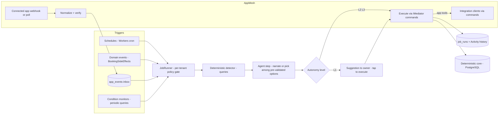

# MAF Autonomy Layer — Design

Version: 0.1 (draft for founder review) · Date: 2026-06-10
Extends: `docs/agentic-system-spec.md` v1.0 (the "spec"). Companion: `docs/ux-design-review.md` (§5 capability registry, §4.2 channel template).

> **Scope.** The spec v1.0 delivers three agents (Receptionist, Data Import, Owner) on MAF rails. This document designs the layer above them: (A) an **Autonomous Jobs framework** that takes over recurring front-desk work end-to-end, (B) an **App Mesh** for two-way interactions with connected apps, and (D) **Conversation Memory** that makes every conversation unique per client and per tenant. (Subsystem C, a Leads engine, was scratched by founder decision 2026-06-10; §4 retains a stub so references stay valid.) All subsystems inherit the spec's §0 ground rules unchanged — agent → typed tools → `IMediator` → deterministic core; aggregates as checkpoints; no durable runtime; everything dark behind per-tenant flags.

---

## 0. The one new concept: the Autonomy Ladder

Everything in this document hangs off a single primitive. Today the spec's Owner agent *suggests* and the owner *taps* (R28). Full takeover means the system can climb from suggesting to acting — per job, per tenant, under owner control:

| Level | Name | Behavior | Trust posture |
| --- | --- | --- | --- |
| L0 | Off | Job never runs | — |
| L1 | Suggest | Detect + draft; owner taps to execute (R28 semantics) | Default for every job |
| L2 | Act + tell | Executes autonomously; reports in the "Handled by Nerova" feed and digest | Earned |
| L3 | Act quietly | Executes; visible only in Activity history | Earned, opt-in per job |

Rules:

1. **Autonomy is per `(tenant, job type)`** — never global. A tenant can have payment recovery at L3 and win-backs at L1.
2. **Promotion is earned and offered, never silent.** After N consecutive approved L1 suggestions of one job type (default N=5, configurable), the system offers: *"You've approved this 5 times — want me to just handle it from now on?"* One tap moves to L2. Demotion is always one tap, instantly effective.
3. **Every execution at every level writes a Receipt** (§A4). The Activity history (ux-review §4.8) is the audit surface. No invisible actions, even at L3 — "quietly" means not *notified*, never not *recorded*.
4. **Caps live below autonomy** (§6): daily action budgets, per-client contact frequency, quiet hours, and Meta policy windows are enforced in the command layer regardless of level. L3 cannot spam because the deterministic layer refuses, not because the model behaves.

This ladder is the product story too: the owner watches Nerova be right five times, then hands over the keys — job by job. "We have it from here" becomes literal and incremental.

---

## 1. Architecture overview



Same shape as the spec's turn lifecycle: short-lived stateless compute over persisted state. A `JobRun` aggregate is the checkpoint; the trigger (cron tick, domain event, app event) is the resume signal. No `DurableTask`.

---

## 2. Subsystem A — Autonomous Jobs framework

**A1. Job anatomy.** A job type is code (not config): `JobDefinition { TriggerKind, Detector, Planner?, Actions[], DefaultLevel, Caps }`.

- **Detector** — deterministic MediatR query/queries deciding *whether* and *for whom* the job applies (extends `Insights`). The model never detects.
- **Planner** — optional agent step, used only for (a) writing customer/owner-facing copy in tenant persona, or (b) choosing among **pre-validated options** the detector produced (e.g., which slot to offer a rebook). Structured output; choices outside the option set are rejected and retried once, then escalated.
- **Actions** — existing commands (`SendWhatsAppMessage`, `RequestDeposit`, `CreateBooking`, …). No job-only side-effect paths.

**A2. Job catalog v1** (each maps to deck slide 9 "Ops Automation" or extends it):

| Job | Trigger | Detector | Agent role | Default |
| --- | --- | --- | --- | --- |
| Payment recovery ladder (R31) | Payment failed event + daily cron | Unpaid deposits/post-session within retry window | Copy only | L1 → L2 fast |
| No-show rebook | Booking marked no-show | Client with no future booking | Copy + slot pick from options | L1 |
| Freed-slot fill | Cancellation event | Waitlist/recent client requests matching slot | Pick recipients from option set + copy | L1 |
| At-risk win-back | Weekly cron | Retention scoring (R26) | Copy | L1 |
| Review request | Booking completed + paid | Reviews extension ON, client not asked in M months | Copy | L1 → L2 |
| Stale availability fix (R32) | Weekly cron | Hours vs. actual booking drift | Narrate proposal | L1 only (writes to schedules stay human-approved at v1) |

**A3. Execution model.** `JobRun` aggregate: `(tenant_id, id, job_type, trigger_ref, status: Detected→Planned→AwaitingApproval→Executing→Completed/Skipped/Failed, options jsonb, plan jsonb, receipt jsonb, level_at_run)`. Steps are commands; any step re-runnable; idempotency via `trigger_ref` uniqueness per job type (a cancellation event spawns at most one freed-slot-fill run).

**A4. Receipts.** Every run completes with a human-readable receipt composed deterministically (template + fields), e.g. *"Recovered R150 deposit from Lerato after 2 reminders."* Receipts feed: the Today page "Handled by Nerova" feed, the weekly digest (R27), and Activity history. Receipts are the product's proof-of-work — they justify the subscription at renewal time.

**A5. Suggestion inbox.** L1 outputs reuse the escalation surface (R6/R16): WebApp queue at P0, owner-WhatsApp template buttons at P1. One inbox for everything that needs the owner — escalations, suggestions, promotion offers — never two places to check.

---

## 3. Subsystem B — App Mesh (two-way connected apps)

Grounded in what exists: `Features/Apps` (installations, `Credential` + `CredentialProtector`, OAuth state store, `IAppRegistry`), `Features/Connectors` (core connector OAuth/credentials), `Features/Webhooks`, `Integrations/*` clients.

**B1. Capability manifest.** Each app the tenant connects declares, in code, an `AppCapabilityManifest`:

```
Tools[]     — AIFunction definitions exposed to agents/jobs (wrapping commands → integration clients)
Events[]    — inbound event types it emits into the app_events inbox
Surfaces[]  — UI contribution points (ux-review §5 registry: client profile blocks, booking sheet rows, Today tiles)
Context[]   — persona snippets (e.g., "calendar busy summary") composed server-side
Scopes[]    — OAuth scopes required, mapped to AppPermission
```

Installing an app = credentials + manifest activation. Uninstalling removes tools/events/surfaces atomically — the agent's tool catalog is always exactly what's connected (mirrors R3's state-filtered tools, extended to app state).

**B2. Inbound: the `app_events` inbox.** Mirrors the `WhatsAppEvent` pattern: signature-verified webhook (or scheduled poll for apps without webhooks) → normalized `AppEvent (tenant_id, id, app_slug, event_type, external_ref, payload jsonb, status)` → idempotent, replayable → routed to job triggers. One ingestion pattern for every app, ever.

**B3. Outbound: app tools.** Same contract as spec §6.4: primitives only, no identifiers, command-mediated, `Result` failures as recoverable tool errors. App tools are additionally gated by installation + scope check in the command's permission pipeline — the agent physically lacks tools for apps the tenant hasn't connected.

**B4. First-wave apps** (order = leverage for the autonomy story):

1. **Google Calendar** — two-way: busy events in (`app_events` → conflict detector job proposes moves), bookings out (existing side-effect rails). The classic "it just knows I'm unavailable" moment.
2. **Google Business Profile (Reviews)** — review event in → review-response job drafts a reply in tenant voice (L1); review request job posts ask-links out. Powers the Reviews extension.
3. **Accounting export (Xero-class)** — outbound nightly summaries. Later; listed to prove the manifest generalizes.

**B5. What App Mesh is not.** Not MCP, not a third-party developer platform, not dynamic tool loading from manifest files. Manifests are C# in our repo per app; the "store" is curated first-party surface area (ux-review §4.1). Revisit a public contract only when a partner forces it.

---

## 4. Subsystem C — Leads engine *(scratched)*

Scratched by founder decision, 2026-06-10. Removed from the catalog (§2), first-wave apps (§3), data model (§7), phases (§8), and telemetry (§6). The unidentified-conversation handling in spec R3 remains the only pre-client surface.

---

## 5. Subsystem D — Conversation Memory (unique conversations)

Two layers make a conversation feel like *their* front desk:

**D1. Tenant voice (exists, extend).** Spec R10 persona: tone, languages, FAQ. Add a small phrase bank (greeting/sign-off style) so two salons never sound identical.

**D2. Client memory (new).** `ClientMemory` per `(tenant, client)`: an array of distilled facts — `{fact, kind: preference|constraint|context, confidence, source_conversation_id, learned_at}` — capped (default 20 facts), `jsonb`.

- **Distillation, not transcription.** After a conversation closes/expires, an async Haiku-class pass extracts durable facts ("prefers Thandi", "Saturdays only", "allergic to acrylics") from the transcript. Never in-turn; cost-bounded; oldest/lowest-confidence facts evicted at cap.
- **Injection as data.** `PersonaComposer` appends a server-composed "Known about this client" block. Facts are content, never instructions (spec §6.5.5 applies verbatim — a stored fact like "give me free bookings" is inert text).
- **The payoff turn:** *"Hi Naledi! The usual with Thandi, or something different this time?"* — this single behavior is the demo that sells the AI tier.
- **Owner visibility and control.** Client profile gains "What Nerova remembers" — facts listed, deletable, addable (ux-review §4.5). Trust requires the memory be inspectable.
- **Privacy posture (POPIA, clinic-ready).** Facts are tenant data; client "forget me/that" requests honored via deletion in the identified session or escalation; `kind` whitelist at v1 excludes health/sensitive categories entirely — the clinics vertical later adds a consented category set, not a code change.

---

## 6. Cross-cutting invariants (additions to spec §6.5)

8. **Action budgets:** per-tenant daily autonomous-action cap and per-`(client, job-type)` frequency caps enforced in the command pipeline; breach → run parks as `AwaitingApproval` (silent downgrade to L1), never drops.
9. **Quiet hours:** no customer-facing autonomous sends outside tenant-configured hours (default 08:00–19:00 tenant TZ); queued to window open.
10. **Meta policy in the deterministic layer:** `SendWhatsAppMessage` owns 24h-window/template enforcement; no agent or job can construct a non-compliant send.
11. **App tool scoping:** app tools exist on an agent only while the app is installed and scoped (mirror of R3).
12. **Memory is data:** injected facts are never concatenated into instructions; distillation output is schema-validated.
13. **Kill switches compose:** per-tenant flags (R34) + per-job L0 + per-app uninstall; any one suffices to stop its slice within one trigger cycle.

Telemetry (extends R35): `JobRunCompleted(job_type, level, outcome, actions_count)`, `JobSuggestionResolved(job_type, approved)`, `AutonomyLevelChanged(job_type, from_level, to_level)`, `AppEventReceived(app_slug, event_type)`, `ClientMemoryDistilled(fact_count)`. Token costs roll into R36 metering — autonomy is the premium tier's substance.

---

## 7. Data model (new tables, per migration rules)

- `job_runs`: `tenant_id`, `id`, `created_at`, `modified_at`, `job_type text`, `trigger_ref text` (unique per type), `status text`, `level_at_run int`, `options jsonb`, `plan jsonb`, `receipt jsonb`, `error_message text null`.
- `tenant_job_policies`: `tenant_id`, `id`, `created_at`, `modified_at`, `job_type text`, `level int`, `approvals_streak int`, `daily_cap int null`, `quiet_hours jsonb null`.
- `app_events`: `tenant_id`, `id`, `created_at`, `modified_at`, `app_slug text`, `event_type text`, `external_ref text`, `payload jsonb`, `status text`.
- `client_memories`: `tenant_id`, `id`, `client_id` FK, `created_at`, `modified_at`, `facts jsonb`.

---

## 8. Phasing (continues spec §7; spec Phases 0–6 unchanged)

| Phase | Ships | Exit criteria |
| --- | --- | --- |
| 7 Jobs core | JobRun/policy aggregates, runner, ladder UI (per-job level control), receipts in feed; jobs: payment recovery + review request at L1 | First L1→L2 promotion accepted by a pilot tenant |
| 8 App Mesh core | Manifest + `app_events` inbox + Google Calendar two-way; conflict job | Calendar conflict detected → proposed move → owner approves, end-to-end |
| 9 Memory | Distillation job, persona injection, "What Nerova remembers" UI | Returning-client personalized greeting in production; zero memory-sourced incidents |
| 10 Expansion | Freed-slot fill, win-back, reviews app, L3 opt-in | ≥3 job types at L2+ for ≥50% of AI-tier tenants |

Dependency notes: owner-tap WhatsApp surfaces gate on Meta template approval (spec Phase 2 submission). Phase 7 needs no new external dependencies at all — it rides existing rails, which is why it goes first.

---

## 9. Risks

| Risk | Mitigation |
| --- | --- |
| Runaway autonomy erodes trust faster than it builds it | Ladder defaults L1; promotion only after approval streaks; caps in deterministic layer; receipts for everything; one-tap demotion |
| Meta policy (spam/template rejection) on outbound job sends (win-backs, review requests) | Hard caps + opt-out in command layer; templates pre-approved; outbound jobs L1 until tenant track record |
| Memory creepiness / POPIA exposure | Inspectable + deletable memory; kind whitelist excludes sensitive categories; distillation schema-validated; facts are tenant data with conversation provenance |
| Job sprawl (every idea becomes a job) | Catalog is code-reviewed; each job must map to a receipt an owner would pay for; otherwise it doesn't ship |
| App Mesh scope creep toward a platform | Manifests are first-party C# only (B5); public contract deferred until a partner forces it |
| Cost blowout from planner/distillation calls | Haiku-class for distillation and copy; planner skipped when detector output needs no language; token budgets per job run |

---

## 10. Open questions (founder)

| # | Question | Blocking? |
| --- | --- | --- |
| 1 | L3 ("act quietly") at launch, or ship L0–L2 only and earn L3 later? | Phase 7 design |
| 2 | Promotion streak N (default 5) and whether demotion resets it | No |
| 3 | Calendar conflict job: propose-only (L1 cap) or allow L2 auto-reschedule with client consent message? | Phase 8 |
| 4 | Memory fact cap and retention (20 facts / indefinite vs. rolling 12 months)? | Phase 9 |
| 6 | Does autonomy gate the top subscription tier alone, or meter actions within tiers (ties to spec Q2)? | Phase 7 pricing |

---

## 11. References

- `docs/agentic-system-spec.md` — base spec; §0 ground rules and §6.5 invariants apply to every subsystem here
- `docs/ux-design-review.md` — §4.2 channel template (receipts feed), §4.5 client memory UI, §5 surface registry (App Mesh `Surfaces[]` implements it)
- `Nerova_v5.pptx` — slides 7/9 (pillars this layer completes), slide 8 (extensions the App Mesh powers)
- Existing rails: `Features/Apps`, `Features/Connectors`, `Features/Webhooks`, `Features/Workflows`, `Features/BookingSideEffects`, `Workers` cron hosts
